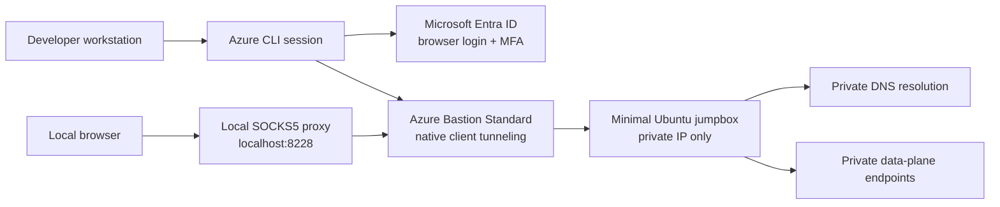
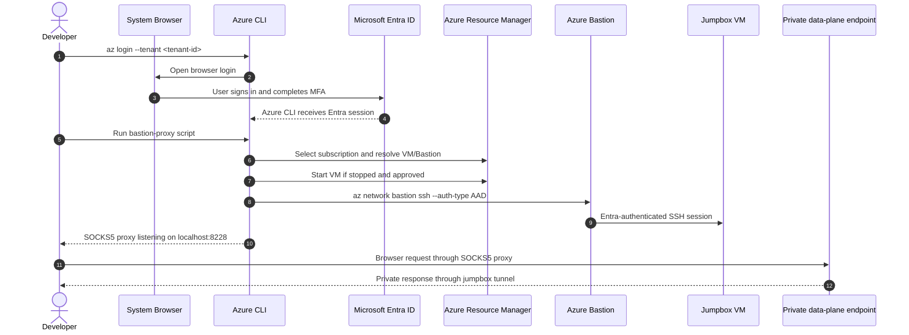
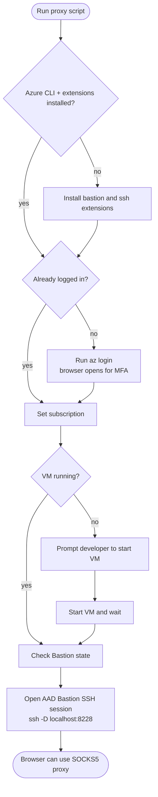
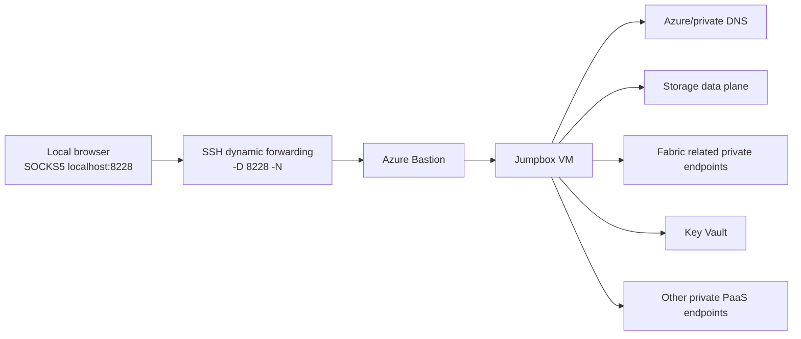
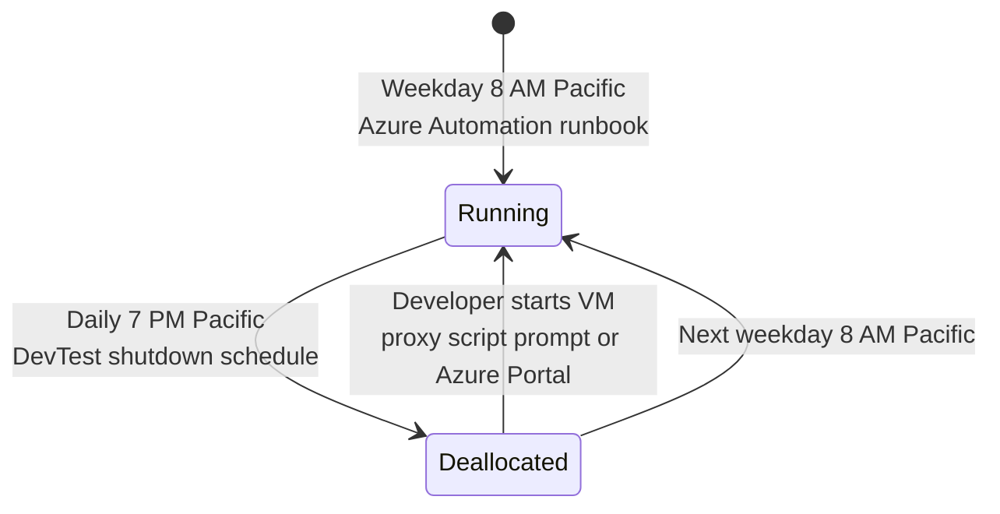
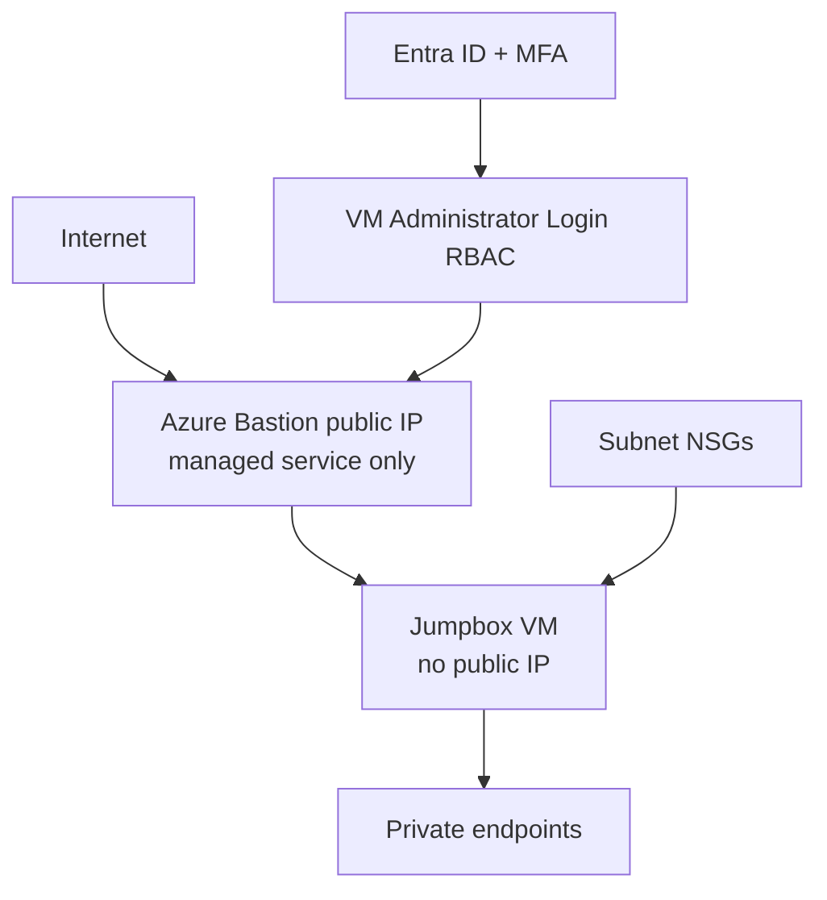

# EO DMI ALZ Fabric Tunnel

This repository provisions a small Azure Bastion based access path so developers can reach private Azure data-plane endpoints from a local browser without a VPN and without exposing the private network to the internet.

Authentication is Entra ID only. Developers sign in with the normal browser-based Azure CLI flow and complete MFA in the browser.
The signing-in Entra user, or a group they belong to, must also have `Virtual Machine Administrator Login` on the Linux jumpbox VM or Bastion SSH authentication will be rejected. This VM role assignment is manual and is not created by Terraform in this repo.

## What Gets Deployed

The Terraform under `infra/` deploys:

- Azure Bastion Standard with native client tunneling enabled
- A minimal Ubuntu jumpbox VM with no public IP
- Entra ID SSH login extension on the jumpbox
- Daily auto-shutdown at 7 PM Pacific time
- Weekday auto-start at 8 AM Pacific time using Azure Automation

Terraform generates an internal bootstrap SSH key pair only because the Azure Linux VM resource requires an `admin_ssh_key` when password authentication is disabled. The private key is not written locally, but it is retained in Terraform state and exposed as a sensitive output for break-glass use. Normal developer access still uses Entra ID only.



## Developer Connection Flow



## Authentication Rules

Use browser-based Entra login with MFA:

```powershell
az login --tenant <tenant-id>
az account set --subscription <subscription-id>
```

Only browser-based Entra MFA login is supported for this workflow.

Access requires:

- Permission to the Azure subscription
- A manual `Virtual Machine Administrator Login` RBAC assignment on the Linux jumpbox VM for the specific signing-in user, or for a group they belong to
- Azure Bastion Standard or Premium with native tunneling enabled
- Azure CLI extensions: `bastion` and `ssh`

If this role assignment is missing, `az network bastion ssh --auth-type AAD` will reach the VM but fail authentication, typically with `Permission denied (publickey)`.

For the `b9cee3` tools environment, make this a manual VM step for:

- `DO_PuC_Azure_Live_b9cee3_Owners`
- `DO_PuC_Azure_Live_b9cee3_Contributors`

Install extensions once:

```powershell
az extension add --name bastion
az extension add --name ssh
```

Break-glass retrieval if Entra login is unavailable:

```powershell
terraform -chdir=infra output -raw jumpbox_admin_username
terraform -chdir=infra output -raw jumpbox_bootstrap_ssh_private_key
```

## Start The Local SOCKS Proxy

Default deployed names for the `tools` environment are:

| Resource | Name |
| --- | --- |
| Resource group | `eo-dmi-alz-fabric-tunnel-tools` |
| Bastion host | `eo-dmi-alz-fabric-tunnel-bastion` |
| Jumpbox VM | `eo-dmi-alz-fabric-tunnel-jumpbox` |
| Default SOCKS port | `8228` |

Windows PowerShell:

```powershell
.\infra\scripts\bastion-proxy.ps1 `
  -ResourceGroup eo-dmi-alz-fabric-tunnel-tools `
  -BastionName eo-dmi-alz-fabric-tunnel-bastion `
  -VmName eo-dmi-alz-fabric-tunnel-jumpbox
```

Bash:

```bash
./infra/scripts/bastion-proxy.sh \
  --resource-group eo-dmi-alz-fabric-tunnel-tools \
  --bastion-name eo-dmi-alz-fabric-tunnel-bastion \
  --vm-name eo-dmi-alz-fabric-tunnel-jumpbox
```

If your current Azure CLI context points to the wrong subscription, run `az account set --subscription <subscription-id>` first or pass `-s/--subscription` to the proxy script.

Before running the proxy, make sure the Entra user you signed in with, or one of their Entra groups, has a manual `Virtual Machine Administrator Login` assignment on the Linux jumpbox VM.

What the script does:

1. Verifies Azure CLI and required extensions.
2. Uses browser-based `az login` if no Azure CLI session exists.
3. Sets the target subscription.
4. Resolves the jumpbox VM resource ID.
5. Prompts to start the VM if it is stopped.
6. Checks that Bastion is provisioned.
7. Opens an Entra-authenticated Bastion SSH session with dynamic SOCKS forwarding.
8. Prints the active SOCKS endpoint, usually `localhost:8228`.



## Configure A Browser

The proxy only affects applications configured to use it. For browser data-plane access, use a dedicated browser profile or proxy configuration so regular browsing is not accidentally routed through the tunnel.

Recommended browser proxy settings:

| Setting | Value |
| --- | --- |
| Proxy type | SOCKS5 |
| Host | `127.0.0.1` or `localhost` |
| Port | `8228` unless the script picked another port |
| DNS | Resolve hostnames through the SOCKS5 proxy when the browser offers this option |

Firefox has an explicit `Proxy DNS when using SOCKS v5` option. Enable it for private endpoint hostnames.

For Chromium-based browsers, launch a temporary profile with an explicit SOCKS proxy:

```powershell
msedge.exe --user-data-dir="$env:TEMP\fabric-tunnel-edge" --proxy-server="socks5://127.0.0.1:8228"
```

```powershell
chrome.exe --user-data-dir="$env:TEMP\fabric-tunnel-chrome" --proxy-server="socks5://127.0.0.1:8228"
```

Then browse to the private data-plane endpoint, for example:

```text
https://<account>.dfs.core.windows.net/
https://<account>.blob.core.windows.net/
https://<workspace-or-service-private-hostname>/
```

## Why SOCKS5 Works For All Endpoints

The SSH `-D` tunnel creates a dynamic SOCKS5 proxy. Instead of opening one port per service, the browser asks the proxy to connect to each target host and port. The jumpbox performs the network access from inside the VNet, where private endpoints and private DNS are reachable.



## VM Schedule



Schedule details:

- Auto-start: 8 AM Pacific, Monday through Friday
- Auto-shutdown: 7 PM Pacific, every day
- Weekends: VM remains stopped unless a developer starts it manually
- Bastion cost is separate from VM cost and applies while Bastion exists

## GitHub Actions Deployment

The workflow in `.github/workflows/deploy-terraform.yml` deploys the infrastructure through GitHub Actions OIDC. That deployment path is non-interactive and separate from developer browser access.

```mermaid
flowchart LR
    gha[GitHub Actions workflow_dispatch]
    oidc[GitHub OIDC token]
    azureLogin[azure/login@v2]
    terraform[Terraform apply]
    rg[Azure resource group]
    resources[Bastion + jumpbox + automation]

    gha --> oidc --> azureLogin --> terraform --> rg --> resources
```

Deployment notes:

- Terraform backend settings are supplied by workflow secrets and variables.
- Human developers do not use GitHub OIDC for browser data-plane access.
- Human developers use Entra browser login with MFA on their workstation.
- The workflow dispatch now accepts `terraform_command` with `apply` or `destroy` and passes that through to `infra/deploy-terraform.sh`.
- To deploy the access path, `enable_bastion` and `enable_jumpbox` must be true in the Terraform inputs used by the environment.
- The Linux jumpbox VM login association is manual. For the `b9cee3` tools environment, associate `DO_PuC_Azure_Live_b9cee3_Owners` and `DO_PuC_Azure_Live_b9cee3_Contributors` with `Virtual Machine Administrator Login` on the VM outside Terraform.

## Security Model



Controls:

- No SSH private key is generated by Terraform.
- Password authentication is disabled on the jumpbox VM.
- SSH access is through Azure Bastion native client tunneling.
- VM login is authorized by a manual Entra ID RBAC assignment, specifically `Virtual Machine Administrator Login` on the Linux jumpbox VM.
- The VM has no public IP address.
- The browser tunnel is local-only on the developer workstation.

## Troubleshooting

| Symptom | Check |
| --- | --- |
| `az network bastion ssh` fails with auth errors | Run `az login --tenant <tenant-id>` and complete MFA in the browser, then confirm `az account show`. |
| Access denied to VM | Confirm the Entra user you signed in with, or one of their groups, has a manual `Virtual Machine Administrator Login` assignment on the Linux jumpbox VM. |
| Proxy starts but browser cannot resolve private hostname | Ensure the browser is using SOCKS5 and proxy DNS is enabled where available. |
| Script says VM is stopped | Let the script start it when prompted, wait for the weekday auto-start, or start it in the Azure Portal. |
| Browser still uses normal internet path | Use a dedicated profile launched with `--proxy-server="socks5://127.0.0.1:8228"`. |
| Bastion command is unavailable | Install or update the Azure CLI `bastion` and `ssh` extensions. |
| Tunnel closes after long use | Re-run `az login` with browser MFA and start the proxy again. |

## Useful Commands

Check current Azure CLI identity:

```powershell
az account show --query "{name:name, tenantId:tenantId, user:user.name}" --output table
```

Start the VM manually:

```powershell
az vm start `
  --resource-group eo-dmi-alz-fabric-tunnel-tools `
  --name eo-dmi-alz-fabric-tunnel-jumpbox
```

Stop and deallocate the VM manually:

```powershell
az vm deallocate `
  --resource-group eo-dmi-alz-fabric-tunnel-tools `
  --name eo-dmi-alz-fabric-tunnel-jumpbox
```

Validate Terraform locally:

```powershell
terraform -chdir=infra init -backend=false
terraform -chdir=infra validate
terraform -chdir=infra fmt -check -recursive
```

Remove local Terraform init artifacts after validation if you do not want to keep them:

```powershell
Remove-Item -Recurse -Force infra\.terraform -ErrorAction SilentlyContinue
Remove-Item -Force infra\.terraform.lock.hcl -ErrorAction SilentlyContinue
```
