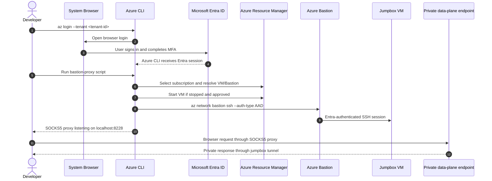
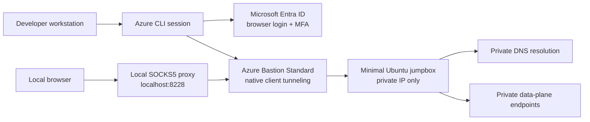
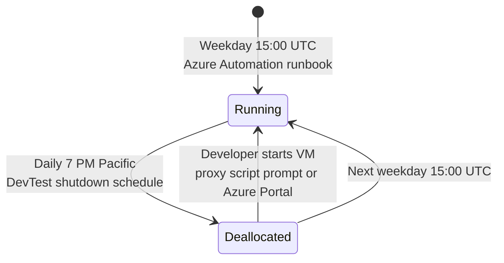
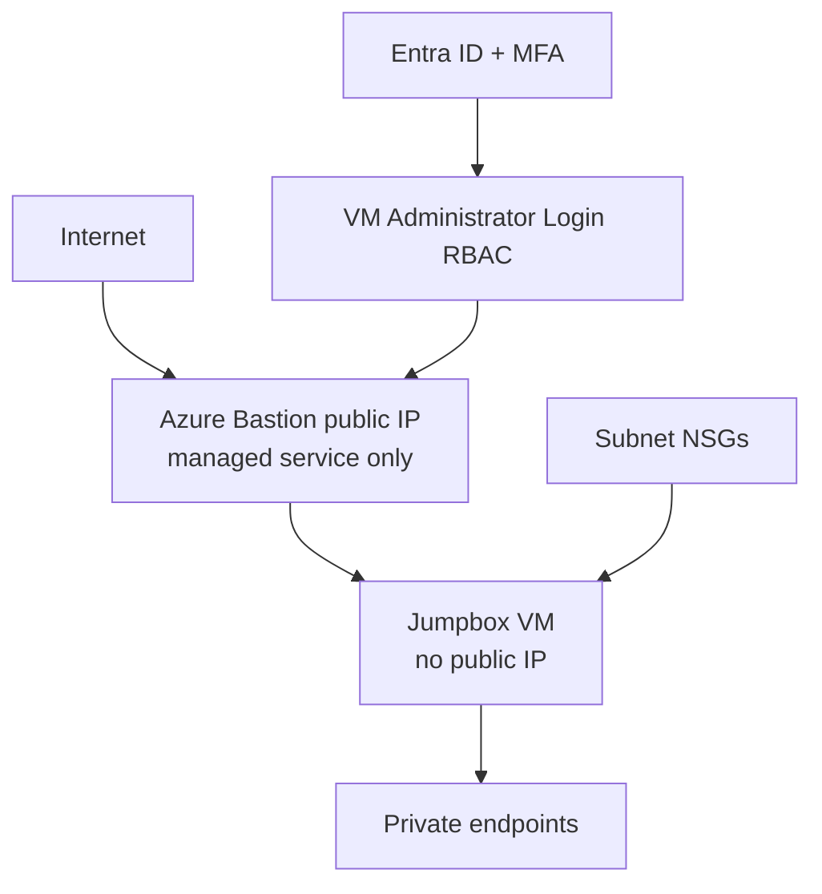
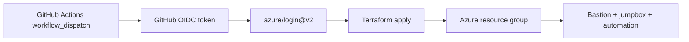
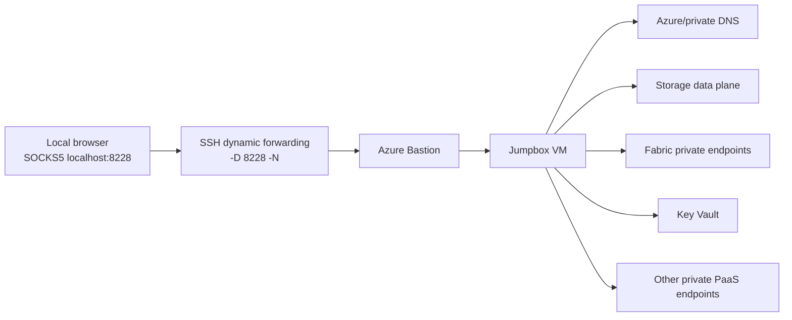

# EO DMI ALZ Bastion Jumpbox

A small **Azure Bastion** access path so developers can reach private Azure endpoints from their workstation — **no VPN, no public IPs, no SSH keys**. Works for both **browsers** (SOCKS5 dynamic proxy) and **native TCP clients** like `psql`, DBeaver, or `redis-cli` (local port forward). Authentication is **Entra ID + MFA** only.

The jumpbox VM is configured with **Automatic VM Guest Patching** and **Azure Update Manager periodic assessment** so update compliance is visible in line with ALZ guardrail expectations.

> **TL;DR** — Install the Azure CLI extensions, run `az login`, make sure your Entra user or group has `Virtual Machine Administrator Login` or `Virtual Machine User Login` on the jumpbox, then run the proxy script and point a dedicated browser profile at `socks5://127.0.0.1:8228`. For database / cache clients see [Native tunneling for data clients](#native-tunneling-for-data-clients).

---

## Table of contents

- [Quick start](#quick-start)
- [Prerequisites](#prerequisites)
- [How it works](#how-it-works)
- [What gets deployed](#what-gets-deployed)
- [Configure your browser](#configure-your-browser)
- [Native tunneling for data clients](#native-tunneling-for-data-clients)
- [VM schedule](#vm-schedule)
- [Security model](#security-model)
- [Bastion audit](#bastion-audit)
- [GitHub Actions deployment](#github-actions-deployment)
- [Troubleshooting](#troubleshooting)
- [Useful commands](#useful-commands)
- [FAQ — Why SOCKS5?](#faq--why-socks5)

---

## Quick start

> Time to first connection: ~2 minutes once prerequisites are in place.

### 1. Sign in to Azure

```bash
az login --tenant <tenant-id>
az account set --subscription eb733692-257d-40c8-bd7b-372e689f3b7f
```

A browser opens for MFA. Only browser-based Entra login is supported.

### 2. Start the SOCKS proxy

**Windows (PowerShell, from the repo root):**

If script execution is already allowed in your shell:

```powershell
.\infra\scripts\bastion-proxy.ps1 `
  -ResourceGroup eo-dmi-alz-bastion-jumpbox-tools `
  -BastionName   eo-dmi-alz-bastion-jumpbox-bastion `
  -VmName        eo-dmi-alz-bastion-jumpbox-jumpbox
```

If Windows execution policy blocks local scripts, run it with an explicit bypass:

```powershell
pwsh -ExecutionPolicy Bypass -File .\infra\scripts\bastion-proxy.ps1 `
  -ResourceGroup eo-dmi-alz-bastion-jumpbox-tools `
  -BastionName   eo-dmi-alz-bastion-jumpbox-bastion `
  -VmName        eo-dmi-alz-bastion-jumpbox-jumpbox
```

```powershell
powershell.exe -ExecutionPolicy Bypass -File .\infra\scripts\bastion-proxy.ps1 `
  -ResourceGroup eo-dmi-alz-bastion-jumpbox-tools `
  -BastionName   eo-dmi-alz-bastion-jumpbox-bastion `
  -VmName        eo-dmi-alz-bastion-jumpbox-jumpbox
```

**macOS / Linux or Git Bash (from the repo root):**

If the script is executable:

```bash
./infra/scripts/bastion-proxy.sh \
  --resource-group eo-dmi-alz-bastion-jumpbox-tools \
  --bastion-name   eo-dmi-alz-bastion-jumpbox-bastion \
  --vm-name        eo-dmi-alz-bastion-jumpbox-jumpbox
```

If you prefer not to rely on the executable bit, invoke it explicitly with Bash:

```bash
bash ./infra/scripts/bastion-proxy.sh \
  --resource-group eo-dmi-alz-bastion-jumpbox-tools \
  --bastion-name   eo-dmi-alz-bastion-jumpbox-bastion \
  --vm-name        eo-dmi-alz-bastion-jumpbox-jumpbox
```

**Run directly from GitHub without cloning the repo:**

PowerShell 7:

```powershell
$tmp = Join-Path ([System.IO.Path]::GetTempPath()) 'bastion-proxy.ps1'
Invoke-WebRequest -Uri 'https://raw.githubusercontent.com/bcgov/eo-dmi-alz-bastion-jumpbox/main/infra/scripts/bastion-proxy.ps1' -OutFile $tmp
try {
  pwsh -ExecutionPolicy Bypass -File $tmp `
    -ResourceGroup eo-dmi-alz-bastion-jumpbox-tools `
    -BastionName   eo-dmi-alz-bastion-jumpbox-bastion `
    -VmName        eo-dmi-alz-bastion-jumpbox-jumpbox
}
finally {
  Remove-Item $tmp -Force -ErrorAction SilentlyContinue
}
```

Windows PowerShell:

```powershell
$tmp = Join-Path $env:TEMP 'bastion-proxy.ps1'
Invoke-WebRequest -Uri 'https://raw.githubusercontent.com/bcgov/eo-dmi-alz-bastion-jumpbox/main/infra/scripts/bastion-proxy.ps1' -OutFile $tmp
try {
  powershell.exe -ExecutionPolicy Bypass -File $tmp `
    -ResourceGroup eo-dmi-alz-bastion-jumpbox-tools `
    -BastionName   eo-dmi-alz-bastion-jumpbox-bastion `
    -VmName        eo-dmi-alz-bastion-jumpbox-jumpbox
}
finally {
  Remove-Item $tmp -Force -ErrorAction SilentlyContinue
}
```

Bash:

```bash
curl -fsSL https://raw.githubusercontent.com/bcgov/eo-dmi-alz-bastion-jumpbox/main/infra/scripts/bastion-proxy.sh \
  | bash -s -- \
    --resource-group eo-dmi-alz-bastion-jumpbox-tools \
    --bastion-name eo-dmi-alz-bastion-jumpbox-bastion \
    --vm-name eo-dmi-alz-bastion-jumpbox-jumpbox
```

Replace `main` with a tag or commit SHA if you want to pin the script version.

The PowerShell examples download the script to a temporary `.ps1` file first and then execute it with `-File`. This avoids quoting and variable-expansion problems when the command is pasted into an existing PowerShell session, and it also works correctly for an advanced script that uses `CmdletBinding()` and `param()`.

The script prints when the SOCKS endpoint is live (default: `localhost:8228`).

### 3. Point a browser at the proxy

Launch a **separate browser profile** so normal browsing isn't routed through the tunnel:

```powershell
# Edge
msedge.exe --user-data-dir="$env:TEMP\bastion-jumpbox-edge" --proxy-server="socks5://127.0.0.1:8228"

# Chrome
chrome.exe --user-data-dir="$env:TEMP\bastion-jumpbox-chrome" --proxy-server="socks5://127.0.0.1:8228"
```

Then browse to your private endpoint, for example `https://<account>.dfs.core.windows.net/`.

> Need a database or cache client instead of a browser? Jump to [Native tunneling for data clients](#native-tunneling-for-data-clients).

---

## Prerequisites

You need **all** of the following before the proxy will work:

| Requirement | Notes |
|---|---|
| Azure subscription access | Reader role or higher on the target subscription |
| `Virtual Machine Administrator Login` or `Virtual Machine User Login` RBAC on the jumpbox | Must be assigned on the VM or an inherited scope such as the resource group; subscription Owner, Contributor, or Reader is not enough for OS login |
| Azure CLI installed | Any recent version |
| `bastion` and `ssh` CLI extensions | See install command below |
| Azure Bastion Standard or Premium | With **native client tunneling** enabled |

If the Bastion tunnel starts and then OpenSSH returns `Permission denied (publickey).`, the Azure control-plane access is working and the VM login RBAC assignment is missing or has not propagated yet.

Install the CLI extensions once:

```bash
az extension add --name bastion
az extension add --name ssh
```

---

## How it works

### Developer connection flow



### High-level architecture



### What the proxy script does


In order, the script:

1. Verifies the Azure CLI and required extensions.
2. Runs `az login` if no session exists.
3. Sets the target subscription.
4. Resolves the jumpbox VM resource ID.
5. Prompts to start the VM if it is stopped.
6. Confirms Bastion is provisioned.
7. Opens an Entra-authenticated Bastion SSH session with dynamic SOCKS forwarding.
8. Prints the active SOCKS endpoint (`localhost:8228` by default).

---

## What gets deployed

Terraform under `infra/` deploys:

- Azure Bastion Standard with native client tunneling
- A minimal Ubuntu jumpbox VM (**no public IP**)
- Entra ID SSH login extension on the jumpbox
- RBAC for configured Entra users or groups
- Daily auto-shutdown at 7 PM Pacific
- Weekday auto-start at 15:00 UTC (Azure Automation, equivalent to 8 AM Pacific with the repo's +7 offset)

> **Security highlight:** No SSH key pair is generated, stored, output, or used for normal access.

### Default resource names

| Resource | Name |
|---|---|
| Resource group | `eo-dmi-alz-bastion-jumpbox-tools` |
| Bastion host | `eo-dmi-alz-bastion-jumpbox-bastion` |
| Jumpbox VM | `eo-dmi-alz-bastion-jumpbox-jumpbox` |
| Default SOCKS port | `8228` |

---

## Configure your browser

The proxy only affects applications configured to use it. **Use a dedicated browser profile** so regular browsing isn't routed through the tunnel.

### Recommended settings

| Setting | Value |
|---|---|
| Proxy type | `SOCKS5` |
| Host | `127.0.0.1` (or `localhost`) |
| Port | `8228` (unless the script picked another port) |
| Remote DNS | **Resolve hostnames through the proxy** |

- **Firefox** — enable *Proxy DNS when using SOCKS v5* in proxy settings.
- **Chromium-based** — launch with `--proxy-server="socks5://127.0.0.1:8228"` (see [Quick start](#3-point-a-browser-at-the-proxy)).

### Example endpoints

```
https://<account>.dfs.core.windows.net/
https://<account>.blob.core.windows.net/
https://<workspace-or-service-private-hostname>/
```

---

## Native tunneling for data clients

The same jumpbox path can expose private **TCP services** to local desktop tools — no browser involved. Developers can run normal data-plane operations from their workstation without making the service public.

**Typical use cases**

- **PostgreSQL** with DBeaver, `psql`, Azure Data Studio, migration tools
- **Redis** with `redis-cli`, debug tooling, cache inspection
- Any other private TCP endpoint the jumpbox can reach inside the VNet

**Two tunneling patterns**

| Pattern | Flag | Use when |
|---|---|---|
| Dynamic SOCKS proxy | `ssh -D` | Browsers, or clients that natively support SOCKS5 |
| Local TCP port forward | `ssh -L` | Service-specific tools that expect a host + port (most DB / cache clients) |

> [!IMPORTANT]
> **Spokes are not natively connected.** If the Bastion / jumpbox and the target resource live in different subscriptions or different spoke VNets, the required network path (peering, NSG, private DNS) **must already be open** — Bastion alone won't bridge them.

### Example: PostgreSQL port forward

```powershell
$vmId = az vm show `
  --subscription    ffc5e617-7f2d-4ddb-8b57-33fc43989a8c `
  --resource-group  eo-dmi-alz-bastion-jumpbox-tools `
  --name            eo-dmi-alz-bastion-jumpbox-jumpbox `
  --query id `
  --output tsv

az network bastion ssh `
  --subscription       ffc5e617-7f2d-4ddb-8b57-33fc43989a8c `
  --name               eo-dmi-alz-bastion-jumpbox-bastion `
  --resource-group     eo-dmi-alz-bastion-jumpbox-tools `
  --target-resource-id $vmId `
  --auth-type          AAD `
  -- -L 127.0.0.1:15432:<postgres-private-hostname-or-ip>:5432 -N -o StrictHostKeyChecking=no
```

Once the tunnel is up, point your client at the local listener:

| Setting | Value |
|---|---|
| Host | `127.0.0.1` |
| Port | `15432` |
| SSL mode | Whatever the target service requires (commonly `require`) |

### Example: Redis port forward

```powershell
$vmId = az vm show `
  --subscription    ffc5e617-7f2d-4ddb-8b57-33fc43989a8c `
  --resource-group  eo-dmi-alz-bastion-jumpbox-tools `
  --name            eo-dmi-alz-bastion-jumpbox-jumpbox `
  --query id `
  --output tsv

az network bastion ssh `
  --subscription       ffc5e617-7f2d-4ddb-8b57-33fc43989a8c `
  --name               eo-dmi-alz-bastion-jumpbox-bastion `
  --resource-group     eo-dmi-alz-bastion-jumpbox-tools `
  --target-resource-id $vmId `
  --auth-type          AAD `
  -- -L 127.0.0.1:16379:<redis-private-hostname-or-ip>:6380 -N -o StrictHostKeyChecking=no
```

Point your client at `127.0.0.1:16379`. For Azure Cache for Redis, use **TLS on port 6380** unless the target service is configured differently.

### Tips

- **Prefer the private FQDN** when private DNS resolves correctly from the jumpbox VNet.
- **Trying to debug a connection?** Substitute the private endpoint IP first — that isolates DNS issues from network reachability issues.
- **Tunnel opens but client times out?** The local side is fine; the problem is almost always the jumpbox→service network path or private DNS, not your workstation.
- **Keep the `az network bastion ssh` window open** for the whole client session — closing it tears down the tunnel.

---

## VM schedule



| Event | When |
|---|---|
| Auto-start | 15:00 UTC, Monday–Friday |
| Auto-shutdown | 7 PM Pacific, daily |
| Weekend default | VM stays stopped unless started manually |

> Bastion is billed continuously while it exists; VM cost is separate and only accrues while the VM is running.
>
> Azure Automation schedules are configured in UTC in this repo. The weekday start time is `15:00 UTC`, and optional Bastion delete/recreate automation uses `02:00 UTC` for delete and `15:00 UTC` for create, matching the requested `+7` Pacific offset.

---

## Security model



### Controls

- No SSH private key is generated by Terraform.
- Password authentication is **disabled** on the jumpbox.
- All SSH traffic flows through Azure Bastion native client tunneling.
- VM login authorization is enforced by Entra ID RBAC.
- The jumpbox has **no public IP**.
- The browser tunnel is local-only to the developer's workstation.

---

## Bastion audit

Terraform now configures an Azure Monitor diagnostic setting on the Bastion host and routes `BastionAuditLogs` into the Log Analytics workspace created by this repo. That gives you an auditable session trail for **who connected**, **when the session started**, **when it ended**, **which VM they targeted**, and **how long it lasted**.

Use the `MicrosoftAzureBastionAuditLogs` table in the Log Analytics workspace. The Bastion `sessions` metric is useful for capacity, but it does **not** identify the user. User/session attribution comes from the audit log table.

> Log ingestion is not instant. Expect a short Azure Monitor delay before a just-started or just-ended session appears in KQL.

### Query: who is connected right now

This query shows sessions whose `SessionEndTime` is still empty and calculates the elapsed time since `SessionStartTime`.

```kql
let BastionName = "eo-dmi-alz-bastion-jumpbox-bastion";
MicrosoftAzureBastionAuditLogs
| where TimeGenerated > ago(1d)
| where _ResourceId has strcat("/bastionHosts/", BastionName)
| extend Identity = coalesce(UserEmail, UserName)
| summarize
    SessionStart = min(SessionStartTime),
    SessionEnd = max(todatetime(SessionEndTime)),
    Identity = take_any(Identity),
    UserName = take_any(UserName),
    Protocol = take_any(Protocol),
    ClientIpAddress = take_any(ClientIpAddress),
    TargetResourceId = take_any(TargetResourceId)
  by TunnelId
| where isnull(SessionEnd)
| extend ConnectedMinutes = round(datetime_diff('second', now(), SessionStart) / 60.0, 2)
| order by SessionStart desc
| project SessionStart, ConnectedMinutes, Identity, UserName, Protocol, ClientIpAddress, TargetResourceId, TunnelId
```

### Query: who connected and for how long

This query shows completed Bastion sessions and uses the logged `Duration` value, which Azure writes in milliseconds once the session ends.

```kql
let BastionName = "eo-dmi-alz-bastion-jumpbox-bastion";
MicrosoftAzureBastionAuditLogs
| where TimeGenerated > ago(7d)
| where _ResourceId has strcat("/bastionHosts/", BastionName)
| extend Identity = coalesce(UserEmail, UserName)
| summarize
    SessionStart = min(SessionStartTime),
    SessionEnd = max(todatetime(SessionEndTime)),
    DurationMs = max(Duration),
    Identity = take_any(Identity),
    UserName = take_any(UserName),
    Protocol = take_any(Protocol),
    ClientIpAddress = take_any(ClientIpAddress),
    TargetResourceId = take_any(TargetResourceId)
  by TunnelId
| where isnotnull(SessionEnd)
| extend DurationMinutes = round(toreal(DurationMs) / 60000.0, 2)
| order by SessionEnd desc
| project SessionStart, SessionEnd, DurationMinutes, Identity, UserName, Protocol, ClientIpAddress, TargetResourceId, TunnelId
```

### Query: total Bastion time by user

Use this to summarize Bastion usage by user over a reporting window.

```kql
let BastionName = "eo-dmi-alz-bastion-jumpbox-bastion";
MicrosoftAzureBastionAuditLogs
| where TimeGenerated > ago(30d)
| where _ResourceId has strcat("/bastionHosts/", BastionName)
| extend Identity = coalesce(UserEmail, UserName)
| summarize
    SessionStart = min(SessionStartTime),
    SessionEnd = max(todatetime(SessionEndTime)),
    DurationMs = max(Duration)
  by TunnelId, Identity, Protocol
| where isnotnull(SessionEnd)
| summarize
    Sessions = count(),
    TotalMinutes = round(sum(toreal(DurationMs)) / 60000.0, 2),
    LastSessionEnd = max(SessionEnd)
  by Identity, Protocol
| order by TotalMinutes desc
```

If your Log Analytics workspace is dedicated to this Bastion host, you can drop the `_ResourceId` filter. If you have multiple Bastion hosts sending to the same workspace, keep the filter and only change `BastionName`.

---

## GitHub Actions deployment



The workflow at `.github/workflows/deploy-terraform.yml` deploys infrastructure non-interactively via GitHub Actions OIDC — separate from developer browser access.

**Deployment notes**

- Terraform backend settings come from workflow secrets and variables.
- Developers **do not** use GitHub OIDC for browser data-plane access — that's Entra browser login with MFA.
- `enable_bastion` and `enable_jumpbox` must be `true` in the Terraform inputs for the environment.
- Add developer or group object IDs to `vm_admin_login_principal_ids` so Entra SSH login is authorized.

---

## Troubleshooting

| Symptom | Fix |
|---|---|
| `az network bastion ssh` fails with auth errors | Re-run `az login --tenant <tenant-id>`, complete MFA, then confirm with `az account show`. |
| Access denied to the VM or `Permission denied (publickey).` after Bastion connects | Confirm your user or group object ID has `Virtual Machine Administrator Login` or `Virtual Machine User Login` on the jumpbox VM or an inherited scope, then wait for RBAC propagation and retry. |
| Proxy starts but the browser can't resolve a private hostname | Make sure the browser is set to SOCKS5 **and** remote DNS is enabled. |
| Script reports the VM is stopped | Let the script start it when prompted, wait for the next weekday auto-start, or start it manually in the portal. |
| Browser still uses the normal internet path | Launch a dedicated profile with `--proxy-server="socks5://127.0.0.1:8228"`. |
| `bastion` command is unavailable | Install or update the CLI extensions: `az extension add --name bastion` and `--name ssh`. |
| Tunnel closes after long use | Re-run `az login` with MFA and restart the proxy script. |

---

## Useful commands

**Check current Azure CLI identity**

```bash
az account show --query "{name:name, tenantId:tenantId, user:user.name}" --output table
```

**Run the proxy from the repo root with PowerShell execution-policy bypass**

```powershell
pwsh -ExecutionPolicy Bypass -File .\infra\scripts\bastion-proxy.ps1 `
  -ResourceGroup eo-dmi-alz-bastion-jumpbox-tools `
  -BastionName   eo-dmi-alz-bastion-jumpbox-bastion `
  -VmName        eo-dmi-alz-bastion-jumpbox-jumpbox
```

**Run the proxy from the repo root with Bash**

```bash
bash ./infra/scripts/bastion-proxy.sh \
  --resource-group eo-dmi-alz-bastion-jumpbox-tools \
  --bastion-name   eo-dmi-alz-bastion-jumpbox-bastion \
  --vm-name        eo-dmi-alz-bastion-jumpbox-jumpbox
```

**Run the proxy directly from GitHub without cloning the repo**

```powershell
$tmp = Join-Path ([System.IO.Path]::GetTempPath()) 'bastion-proxy.ps1'
Invoke-WebRequest -Uri 'https://raw.githubusercontent.com/bcgov/eo-dmi-alz-bastion-jumpbox/main/infra/scripts/bastion-proxy.ps1' -OutFile $tmp
try {
  pwsh -ExecutionPolicy Bypass -File $tmp `
    -ResourceGroup eo-dmi-alz-bastion-jumpbox-tools `
    -BastionName   eo-dmi-alz-bastion-jumpbox-bastion `
    -VmName        eo-dmi-alz-bastion-jumpbox-jumpbox
}
finally {
  Remove-Item $tmp -Force -ErrorAction SilentlyContinue
}
```

```bash
curl -fsSL https://raw.githubusercontent.com/bcgov/eo-dmi-alz-bastion-jumpbox/main/infra/scripts/bastion-proxy.sh \
  | bash -s -- \
    --resource-group eo-dmi-alz-bastion-jumpbox-tools \
    --bastion-name eo-dmi-alz-bastion-jumpbox-bastion \
    --vm-name eo-dmi-alz-bastion-jumpbox-jumpbox
```

**Start the VM manually**

```bash
az vm start \
  --resource-group eo-dmi-alz-bastion-jumpbox-tools \
  --name           eo-dmi-alz-bastion-jumpbox-jumpbox
```

**Stop and deallocate the VM manually**

```bash
az vm deallocate \
  --resource-group eo-dmi-alz-bastion-jumpbox-tools \
  --name           eo-dmi-alz-bastion-jumpbox-jumpbox
```

**Validate Terraform locally**

```bash
terraform -chdir=infra init -backend=false
terraform -chdir=infra validate
terraform -chdir=infra fmt -check -recursive
```

**Clean up local Terraform artifacts (PowerShell)**

```powershell
Remove-Item -Recurse -Force infra\.terraform        -ErrorAction SilentlyContinue
Remove-Item -Force         infra\.terraform.lock.hcl -ErrorAction SilentlyContinue
```

---

## FAQ — Why SOCKS5?

<details>
<summary>Why does one SOCKS5 port reach every private endpoint?</summary>

The SSH `-D` flag creates a **dynamic** SOCKS5 proxy. Instead of opening a separate forwarded port per service, the browser asks the proxy to connect to each `host:port` on demand. Network access happens **inside the VNet** from the jumpbox, where private endpoints and private DNS are reachable.



</details>
