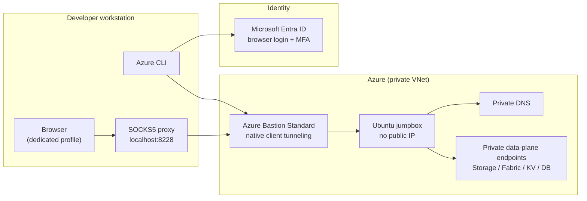
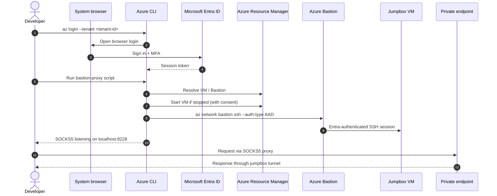
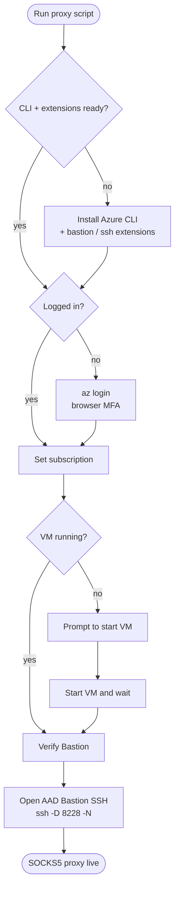
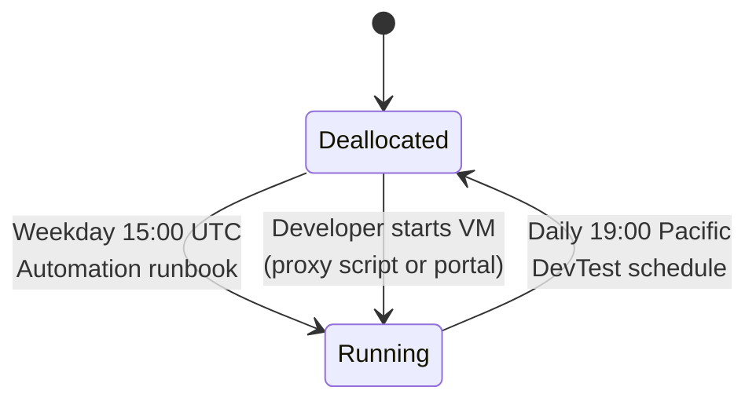
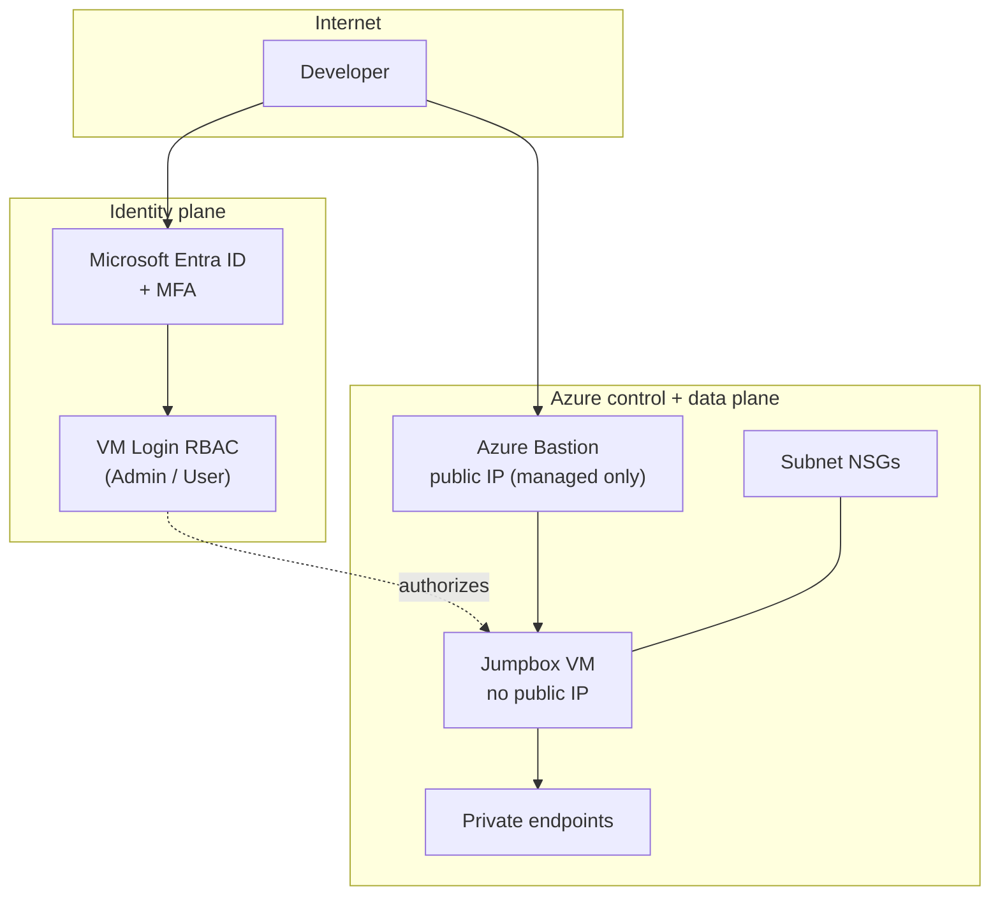
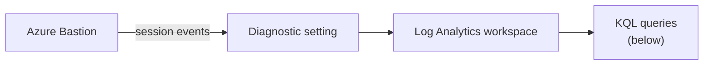
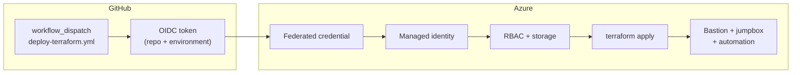
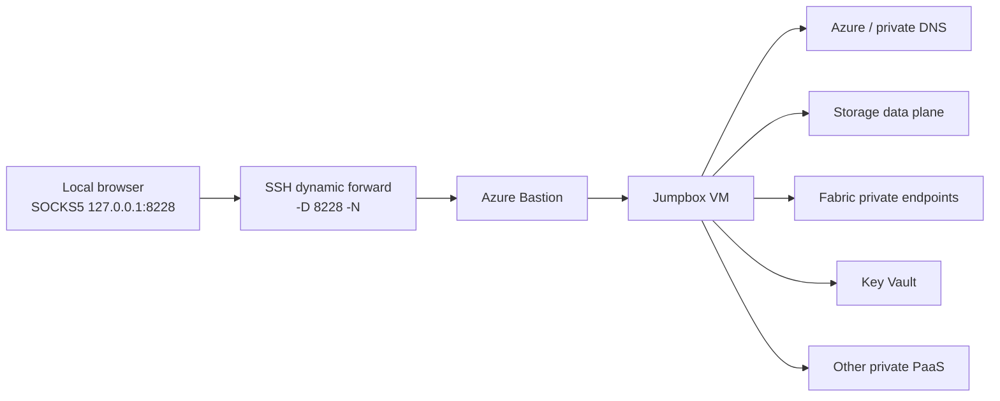

# EO DMI ALZ Bastion Jumpbox

> **Private Azure access for developers following Azure landing zone policy — no VPN, no public IPs, no SSH keys.**

A small **Azure Bastion + Linux jumpbox** access path so developers can reach private Azure
endpoints from their workstation. Works for **browsers** (SOCKS5 dynamic proxy) and **native
TCP clients** like `psql`, DBeaver, or `redis-cli` (local port forward). Authentication is
**Microsoft Entra ID + MFA** only.

The jumpbox is configured with **Automatic VM Guest Patching** and **Azure Update Manager
periodic assessment** so update compliance is visible and ✅ aligned with the
[BC Gov Azure Bastion guidance](https://developer.gov.bc.ca/docs/default/component/public-cloud-techdocs/azure/tools/bastion/).

---

## TL;DR

```text
1. az login                                          # browser MFA
2. ./infra/scripts/bastion-proxy.{sh|ps1} ...        # tunnel up on localhost:8228
3. Launch a dedicated browser profile → SOCKS5 127.0.0.1:8228
```

You will need `Virtual Machine Administrator Login` (or `User Login`) RBAC on the jumpbox.
For database / cache clients, see [Native tunneling for data clients](#native-tunneling-for-data-clients).

---

## Table of contents

- [At a glance](#at-a-glance)
- [Architecture](#architecture)
- [What gets deployed](#what-gets-deployed)
- [Repository structure](#repository-structure)
- [Prerequisites](#prerequisites)
- [Quick start](#quick-start)
- [Configure your browser](#configure-your-browser)
- [Native tunneling for data clients](#native-tunneling-for-data-clients)
- [VM schedule and cost](#vm-schedule-and-cost)
- [Security model](#security-model)
- [Bastion audit](#bastion-audit)
- [GitHub Actions deployment](#github-actions-deployment)
- [Troubleshooting](#troubleshooting)
- [Useful commands](#useful-commands)
- [FAQ](#faq)
- [Glossary](#glossary)
- [Related docs](#related-docs)

---

## At a glance

| | |
|---|---|
| **What** | Azure Bastion + minimal Ubuntu jumpbox in a private VNet |
| **Why** | Reach private endpoints (Storage, Fabric, Key Vault, Postgres, Redis, …) from a workstation without a VPN or public IPs |
| **Who** | Developers with Entra access to the subscription and VM login RBAC on the jumpbox |
| **How auth** | Browser-based `az login` with MFA → Entra → Bastion → jumpbox |
| **How traffic** | SOCKS5 dynamic proxy (`ssh -D`) for browsers, local port forward (`ssh -L`) for TCP clients |
| **Default SOCKS port** | `127.0.0.1:8228` |
| **Time to first connection** | ~2 minutes once prerequisites are in place |

---

## Architecture

### High-level topology



### Developer connection flow



### What the proxy script does



---

## What gets deployed

Terraform under `infra/` deploys:

| Component | Purpose |
|---|---|
| Azure Bastion **Standard** | Native client tunneling for AAD-authenticated SSH |
| Ubuntu jumpbox VM | Minimal Linux host, **no public IP**, Entra SSH extension installed |
| RBAC assignments | `Virtual Machine Administrator Login` / `User Login` for configured Entra principals |
| Auto-shutdown schedule | Daily 7 PM Pacific (DevTest schedule on the VM) |
| Auto-start schedule | Weekdays 15:00 UTC (Azure Automation runbook) |
| Log Analytics workspace | Receives `BastionAuditLogs` diagnostic stream |
| Automatic VM Guest Patching | OS patching on the jumpbox |
| Update Manager periodic assessment | Visibility into update compliance |

> **Security highlight:** No SSH key pair is generated, stored, output, or used for normal
> access. All authorization flows through Entra ID RBAC.

### Example deployment values

| Item | Value |
|---|---|
| Subscription ID | `ffc5e617-7f2d-4ddb-8b57-33fc43989a8c` |
| Resource group | `eo-dmi-alz-bastion-jumpbox-tools` |
| Bastion host | `eo-dmi-alz-bastion-jumpbox-bastion` |
| Jumpbox VM | `eo-dmi-alz-bastion-jumpbox-jumpbox` |
| GitHub repo | `bcgov/eo-dmi-alz-bastion-jumpbox` |
| Git ref | `main` |
| Default SOCKS port | `8228` |

---

## Repository structure

```text
.
├── infra/
│   ├── scripts/
│   │   ├── bastion-proxy.ps1     # Windows / PowerShell entry point
│   │   └── bastion-proxy.sh      # macOS / Linux / Git Bash entry point
│   └── *.tf                      # Terraform (Bastion, VM, RBAC, schedules, audit)
├── .github/workflows/
│   └── deploy-terraform.yml      # OIDC-authenticated terraform apply
├── initial-azure-setup.sh        # One-time GitHub OIDC bootstrap
├── initial-azure-setup.md        # Setup guide for the bootstrap script
└── README.md                     # You are here
```

---

## Prerequisites

You need **all** of the following before the proxy will work.

### Tools

| Tool | Required | Notes |
|---|---|---|
| Azure CLI | ✅ | Any recent version. Scripts will install automatically when a supported package manager is available. |
| `az` extensions: `bastion`, `ssh` | ✅ | Scripts install these automatically into a dedicated CLI extension cache. |
| PowerShell 5.1+ or `pwsh` 7+ | Windows | For `bastion-proxy.ps1` |
| Bash 4+ | macOS / Linux / Git Bash | For `bastion-proxy.sh` |

### Permissions

| Permission | Scope | Why |
|---|---|---|
| Reader (or higher) on the subscription | Subscription | Resolve VM / Bastion via ARM |
| `Virtual Machine Administrator Login` **or** `Virtual Machine User Login` | Jumpbox VM (or inherited from RG) | Entra-authenticated OS login |
| Azure Bastion Standard or Premium | The Bastion host | Native client tunneling must be enabled |

> [!IMPORTANT]
> Subscription Owner / Contributor / Reader is **not** enough for OS login. You must hold one
> of the VM Login roles directly on the VM or an inherited scope.

> [!TIP]
> If the Bastion tunnel starts and then OpenSSH returns `Permission denied (publickey).`, the
> Azure control plane is fine — the VM Login RBAC assignment is missing or has not propagated
> yet. Wait a few minutes and retry.

### Manual extension install (only if needed)

<details>
<summary>Skip this — the scripts handle it. Open only if you want to install manually.</summary>

```bash
az extension add --name bastion
az extension add --name ssh
```
</details>

---

## Quick start

> Time to first connection: **~2 minutes** once the prerequisites above are in place.

### 1. Sign in to Azure

```bash
az login --tenant <tenant-id>
az account set --subscription <subscription-id>
```

| Placeholder | Example for this deployment |
|---|---|
| `<tenant-id>` | Your tenant ID |
| `<subscription-id>` | `ffc5e617-7f2d-4ddb-8b57-33fc43989a8c` |
| `<resource-group>` | `eo-dmi-alz-bastion-jumpbox-tools` |
| `<bastion-name>` | `eo-dmi-alz-bastion-jumpbox-bastion` |
| `<vm-name>` | `eo-dmi-alz-bastion-jumpbox-jumpbox` |

A browser opens for MFA. Only browser-based Entra login is supported.

### 2. Start the SOCKS proxy

Pick the entry point that matches your shell, then jump to step 3.

#### macOS / Linux / Git Bash

```bash
./infra/scripts/bastion-proxy.sh \
  --resource-group <resource-group> \
  --bastion-name   <bastion-name> \
  --vm-name        <vm-name>
```

#### Windows (PowerShell 7+)

```powershell
.\infra\scripts\bastion-proxy.ps1 `
  -ResourceGroup <resource-group> `
  -BastionName   <bastion-name> `
  -VmName        <vm-name>
```

If Windows execution policy blocks local scripts, prefix with a bypass:

```powershell
pwsh -ExecutionPolicy Bypass -File .\infra\scripts\bastion-proxy.ps1 `
  -ResourceGroup <resource-group> `
  -BastionName   <bastion-name> `
  -VmName        <vm-name>
```

The script prints when the SOCKS endpoint is live (default `localhost:8228`).
**Keep this terminal window open** — closing it tears down the tunnel.

<details>
<summary>Run the script directly from GitHub (no clone required)</summary>

These variants download the script to a temp file, execute it, then delete it. Pin `<ref>`
to a tag or commit SHA if you want a fixed script version.

**Bash:**

```bash
curl -fsSL https://raw.githubusercontent.com/<repo-owner>/<repo-name>/<ref>/infra/scripts/bastion-proxy.sh \
  | bash -s -- \
    --resource-group <resource-group> \
    --bastion-name   <bastion-name> \
    --vm-name        <vm-name>
```

**PowerShell 7:**

```powershell
$tmp = Join-Path ([System.IO.Path]::GetTempPath()) 'bastion-proxy.ps1'
Invoke-WebRequest -Uri 'https://raw.githubusercontent.com/<repo-owner>/<repo-name>/<ref>/infra/scripts/bastion-proxy.ps1' -OutFile $tmp
try {
  pwsh -ExecutionPolicy Bypass -File $tmp `
    -ResourceGroup <resource-group> `
    -BastionName   <bastion-name> `
    -VmName        <vm-name>
}
finally {
  Remove-Item $tmp -Force -ErrorAction SilentlyContinue
}
```

**Windows PowerShell 5.1:**

```powershell
$tmp = Join-Path $env:TEMP 'bastion-proxy.ps1'
Invoke-WebRequest -Uri 'https://raw.githubusercontent.com/<repo-owner>/<repo-name>/<ref>/infra/scripts/bastion-proxy.ps1' -OutFile $tmp
try {
  powershell.exe -ExecutionPolicy Bypass -File $tmp `
    -ResourceGroup <resource-group> `
    -BastionName   <bastion-name> `
    -VmName        <vm-name>
}
finally {
  Remove-Item $tmp -Force -ErrorAction SilentlyContinue
}
```

> Downloading to a `.ps1` first (instead of `iex`-piping) avoids quoting / variable-expansion
> issues and works correctly with the script's `CmdletBinding()` + `param()` signature.
</details>

### 3. Point a browser at the proxy

Launch a **dedicated browser profile** so regular browsing isn't routed through the tunnel.

```powershell
# Edge
msedge.exe --user-data-dir="$env:TEMP\bastion-jumpbox-edge" --proxy-server="socks5://127.0.0.1:8228"

# Chrome
chrome.exe --user-data-dir="$env:TEMP\bastion-jumpbox-chrome" --proxy-server="socks5://127.0.0.1:8228"
```

Then browse to your private endpoint — e.g. `https://<account>.dfs.core.windows.net/`.

➡️ Need a database or cache client instead? See [Native tunneling for data clients](#native-tunneling-for-data-clients).

---

## Configure your browser

The proxy only affects applications configured to use it.

| Setting | Value |
|---|---|
| Proxy type | `SOCKS5` |
| Host | `127.0.0.1` (or `localhost`) |
| Port | `8228` (unless the script picked another port) |
| Remote DNS | **Resolve hostnames through the proxy** ← required for private DNS |

- **Firefox** — enable *Proxy DNS when using SOCKS v5* in proxy settings.
- **Chromium-based** — launch with `--proxy-server="socks5://127.0.0.1:8228"`.

### Example endpoints to test

```text
https://<account>.dfs.core.windows.net/
https://<account>.blob.core.windows.net/
https://<workspace-or-service-private-hostname>/
```

---

## Native tunneling for data clients

The jumpbox can also expose private **TCP services** to local desktop tools — no browser involved.

**Typical use cases**

- **PostgreSQL** with DBeaver, `psql`, Azure Data Studio, migration tools
- **Redis** with `redis-cli`, debug tooling, cache inspection
- Any private TCP endpoint the jumpbox can reach inside the VNet

**Tunneling patterns**

| Pattern | Flag | Use when |
|---|---|---|
| Dynamic SOCKS proxy | `ssh -D` | Browsers, or clients that natively support SOCKS5 |
| Local TCP port forward | `ssh -L` | Service-specific tools that expect a host + port (most DB / cache clients) |

> [!IMPORTANT]
> **Spokes are not bridged for you.** If the Bastion / jumpbox and the target resource live in
> different subscriptions or different spoke VNets, the required network path (peering, NSG,
> private DNS) **must already be open** — Bastion alone will not bridge them.

### Example: PostgreSQL port forward

```powershell
$vmId = az vm show `
  --subscription   <subscription-id> `
  --resource-group <resource-group> `
  --name           <vm-name> `
  --query id --output tsv

az network bastion ssh `
  --subscription       <subscription-id> `
  --name               <bastion-name> `
  --resource-group     <resource-group> `
  --target-resource-id $vmId `
  --auth-type          AAD `
  -- -L 127.0.0.1:15432:<postgres-private-hostname-or-ip>:5432 -N -o StrictHostKeyChecking=no
```

Once the tunnel is up, point your client at the local listener:

| Setting | Value |
|---|---|
| Host | `127.0.0.1` |
| Port | `15432` |
| SSL mode | Whatever the target requires (commonly `require`) |

### Example: Redis port forward

```powershell
$vmId = az vm show `
  --subscription   <subscription-id> `
  --resource-group <resource-group> `
  --name           <vm-name> `
  --query id --output tsv

az network bastion ssh `
  --subscription       <subscription-id> `
  --name               <bastion-name> `
  --resource-group     <resource-group> `
  --target-resource-id $vmId `
  --auth-type          AAD `
  -- -L 127.0.0.1:16379:<redis-private-hostname-or-ip>:6380 -N -o StrictHostKeyChecking=no
```

Point your client at `127.0.0.1:16379`. For Azure Cache for Redis, use **TLS on port 6380**
unless the target service is configured differently.

### Tips

- **Prefer the private FQDN** when private DNS resolves correctly from the jumpbox VNet.
- **Debugging a connection?** Substitute the private endpoint IP first — that isolates DNS from network reachability.
- **Tunnel opens but client times out?** The local side is fine — investigate the jumpbox → service path or private DNS, not your workstation.
- **Keep the `az network bastion ssh` window open** for the entire client session.

---

## VM schedule and cost



| Event | When | Where it lives |
|---|---|---|
| Auto-start | Weekdays 15:00 UTC | Azure Automation runbook |
| Auto-shutdown | Daily 19:00 Pacific | DevTest auto-shutdown on the VM |
| Weekend default | VM stays stopped unless started manually | — |

> [!NOTE]
> **Time-zone math.** Azure Automation schedules in this repo are configured in **UTC**.
> `15:00 UTC` lands at **08:00 PDT** (Mar–Nov, UTC-7) and **07:00 PST** (Nov–Mar, UTC-8).
> The optional Bastion delete/recreate automation uses `02:00 UTC` for delete and
> `15:00 UTC` for create.

### Cost notes

| Resource | Billing characteristic |
|---|---|
| Azure Bastion Standard | **Continuous hourly charge** while the host exists, regardless of VM state |
| Jumpbox VM | Charged **only while running** (auto-shutdown saves cost overnight) |
| Log Analytics ingestion | Volume-based — `BastionAuditLogs` are low volume |

To zero out compute cost between sprints, delete and re-create the Bastion host
(the optional automation in this repo handles this on a schedule).

---

## Security model



### Controls

- No SSH private key is generated by Terraform.
- Password authentication is **disabled** on the jumpbox.
- All SSH traffic flows through Azure Bastion native client tunneling.
- VM login authorization is enforced by Entra ID RBAC.
- The jumpbox has **no public IP**.
- The browser tunnel is local-only to the developer's workstation.

---

## Bastion audit

Terraform configures an Azure Monitor diagnostic setting on the Bastion host and routes
`BastionAuditLogs` into the Log Analytics workspace created by this repo. That gives you an
auditable session trail for **who connected**, **when the session started**, **when it ended**,
**which VM they targeted**, and **how long it lasted**.



Use the `MicrosoftAzureBastionAuditLogs` table. The Bastion `sessions` metric is useful for
capacity, but it does **not** identify the user — user / session attribution comes from the
audit log table.

> [!NOTE]
> Log ingestion is **not instant**. Expect a short Azure Monitor delay before a just-started or
> just-ended session appears in KQL.

Set `BastionName` to your Bastion resource name (for this deployment, `eo-dmi-alz-bastion-jumpbox-bastion`).

### Query: who is connected right now

Sessions whose `SessionEndTime` is still empty, with elapsed time since `SessionStartTime`.

```kql
let BastionName = "<bastion-name>";
MicrosoftAzureBastionAuditLogs
| where TimeGenerated > ago(1d)
| where _ResourceId has strcat("/bastionHosts/", BastionName)
| extend Identity = coalesce(UserEmail, UserName)
| summarize
    SessionStart   = min(SessionStartTime),
    SessionEnd     = max(todatetime(SessionEndTime)),
    Identity       = take_any(Identity),
    UserName       = take_any(UserName),
    Protocol       = take_any(Protocol),
    ClientIpAddress= take_any(ClientIpAddress),
    TargetResourceId = take_any(TargetResourceId)
  by TunnelId
| where isnull(SessionEnd)
| extend ConnectedMinutes = round(datetime_diff('second', now(), SessionStart) / 60.0, 2)
| order by SessionStart desc
| project SessionStart, ConnectedMinutes, Identity, UserName, Protocol, ClientIpAddress, TargetResourceId, TunnelId
```

### Query: who connected and for how long

Completed sessions, using the logged `Duration` value (milliseconds).

```kql
let BastionName = "<bastion-name>";
MicrosoftAzureBastionAuditLogs
| where TimeGenerated > ago(7d)
| where _ResourceId has strcat("/bastionHosts/", BastionName)
| extend Identity = coalesce(UserEmail, UserName)
| summarize
    SessionStart   = min(SessionStartTime),
    SessionEnd     = max(todatetime(SessionEndTime)),
    DurationMs     = max(Duration),
    Identity       = take_any(Identity),
    UserName       = take_any(UserName),
    Protocol       = take_any(Protocol),
    ClientIpAddress= take_any(ClientIpAddress),
    TargetResourceId = take_any(TargetResourceId)
  by TunnelId
| where isnotnull(SessionEnd)
| extend DurationMinutes = round(toreal(DurationMs) / 60000.0, 2)
| order by SessionEnd desc
| project SessionStart, SessionEnd, DurationMinutes, Identity, UserName, Protocol, ClientIpAddress, TargetResourceId, TunnelId
```

### Query: total Bastion time by user

```kql
let BastionName = "<bastion-name>";
MicrosoftAzureBastionAuditLogs
| where TimeGenerated > ago(30d)
| where _ResourceId has strcat("/bastionHosts/", BastionName)
| extend Identity = coalesce(UserEmail, UserName)
| summarize
    SessionStart = min(SessionStartTime),
    SessionEnd   = max(todatetime(SessionEndTime)),
    DurationMs   = max(Duration)
  by TunnelId, Identity, Protocol
| where isnotnull(SessionEnd)
| summarize
    Sessions      = count(),
    TotalMinutes  = round(sum(toreal(DurationMs)) / 60000.0, 2),
    LastSessionEnd = max(SessionEnd)
  by Identity, Protocol
| order by TotalMinutes desc
```

> If your workspace is dedicated to a single Bastion host, you can drop the `_ResourceId`
> filter. For multi-Bastion workspaces, keep it and just change `BastionName`.

---

## GitHub Actions deployment



The workflow at `.github/workflows/deploy-terraform.yml` deploys infrastructure
non-interactively via GitHub Actions OIDC — **separate from developer browser access**.

For the one-time bootstrap (managed identity, federated credential, optional Terraform state
storage, optional GitHub environment secrets), follow **[initial-azure-setup.md](initial-azure-setup.md)**.

**Deployment notes**

- Terraform backend settings come from workflow secrets and variables.
- Developers do **not** use GitHub OIDC for browser data-plane access — that path is Entra browser login + MFA.
- `enable_bastion` and `enable_jumpbox` must be `true` in the Terraform inputs for the environment.
- Add developer or group object IDs to `vm_admin_login_principal_ids` so Entra SSH login is authorized.

---

## Troubleshooting

| Symptom | Likely cause | Fix |
|---|---|---|
| `az network bastion ssh` fails with auth errors | Expired or missing Entra session | Re-run `az login --tenant <tenant-id>`, complete MFA, confirm with `az account show` |
| Tunnel opens, then `Permission denied (publickey).` | Missing VM Login RBAC, or assignment not yet propagated | Assign `Virtual Machine Administrator Login` / `User Login` on the VM (or inherited scope); wait a few minutes |
| Proxy starts but browser can't resolve a private hostname | DNS resolved locally instead of remotely | Enable **Remote DNS** / `proxy DNS when using SOCKS v5` and use SOCKS5 (not SOCKS4) |
| Script reports the VM is stopped | Outside auto-start window | Let the script start it when prompted, wait for next weekday 15:00 UTC, or `az vm start` manually |
| Browser still uses the normal internet path | Default profile ignores the proxy flag | Launch a dedicated profile with `--proxy-server="socks5://127.0.0.1:8228"` |
| `bastion` command not found | Missing CLI extensions | `az extension add --name bastion` and `--name ssh` |
| Tunnel closes after long idle | Entra token expiry | Re-run `az login` with MFA and restart the proxy script |
| Data client times out, but tunnel is "open" | Network path / private DNS between jumpbox and target | Verify peering, NSG, and private DNS; try the target's private IP directly to isolate DNS |

---

## Useful commands

**Check current Azure CLI identity**

```bash
az account show --query "{name:name, tenantId:tenantId, user:user.name}" --output table
```

**Start / stop the VM manually**

```bash
az vm start      --resource-group <resource-group> --name <vm-name>
az vm deallocate --resource-group <resource-group> --name <vm-name>
```

**Validate Terraform locally**

```bash
terraform -chdir=infra init -backend=false
terraform -chdir=infra validate
terraform -chdir=infra fmt -check -recursive
```

**Clean up local Terraform artifacts (PowerShell)**

```powershell
Remove-Item -Recurse -Force infra\.terraform        -ErrorAction SilentlyContinue
Remove-Item -Force         infra\.terraform.lock.hcl -ErrorAction SilentlyContinue
```

---

## FAQ

<details>
<summary><strong>Why does one SOCKS5 port reach every private endpoint?</strong></summary>

The SSH `-D` flag creates a **dynamic** SOCKS5 proxy. Instead of opening a separate forwarded
port per service, the browser asks the proxy to connect to each `host:port` on demand. Network
access happens **inside the VNet** from the jumpbox, where private endpoints and private DNS
are reachable.


</details>

<details>
<summary><strong>Why not just use a VPN?</strong></summary>

A VPN exposes the developer's whole machine to the private network and requires per-user
client provisioning. Bastion + jumpbox limits blast radius to one VM, authenticates every
session through Entra with MFA, and produces a full per-session audit trail.
</details>

<details>
<summary><strong>Can I use this for RDP or another non-SSH protocol?</strong></summary>

This jumpbox is Linux + SSH only. The Bastion host itself supports RDP for Windows targets,
but that flow is out of scope for this repo.
</details>

<details>
<summary><strong>Why is the Bastion host always charged?</strong></summary>

Azure Bastion is billed per hour while the resource exists, regardless of whether any session
is active. The optional Bastion delete/recreate automation in this repo can be used to
zero-out the host outside business hours if cost is a concern.
</details>

---

## Glossary

| Term | Meaning |
|---|---|
| **ALZ** | Azure Landing Zone — the BC Gov platform reference architecture this repo plugs into |
| **Bastion native client tunneling** | The Bastion feature that allows `az network bastion ssh` instead of the portal UI |
| **AAD auth-type** | `--auth-type AAD` — tells Bastion to use Entra (no SSH keys) for OS login |
| **Dynamic forward (`ssh -D`)** | Creates a local SOCKS5 proxy; the remote side decides where to connect |
| **Local forward (`ssh -L`)** | Forwards a single local TCP port to a specific remote `host:port` |
| **Spoke** | A VNet peered into the ALZ hub; the jumpbox lives in one and can reach others only when peering / DNS allow it |
| **OIDC federation** | GitHub-issued short-lived token traded for an Azure access token — no stored client secret |

---

## Related docs

- **[initial-azure-setup.md](initial-azure-setup.md)** — one-time GitHub OIDC bootstrap for the deployment pipeline
- [Azure Bastion native client](https://learn.microsoft.com/azure/bastion/connect-native-client-windows)
- [Entra ID login for Linux VMs](https://learn.microsoft.com/azure/active-directory/devices/howto-vm-sign-in-azure-ad-linux)
