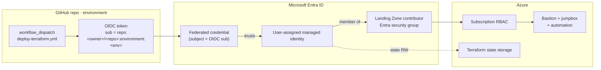
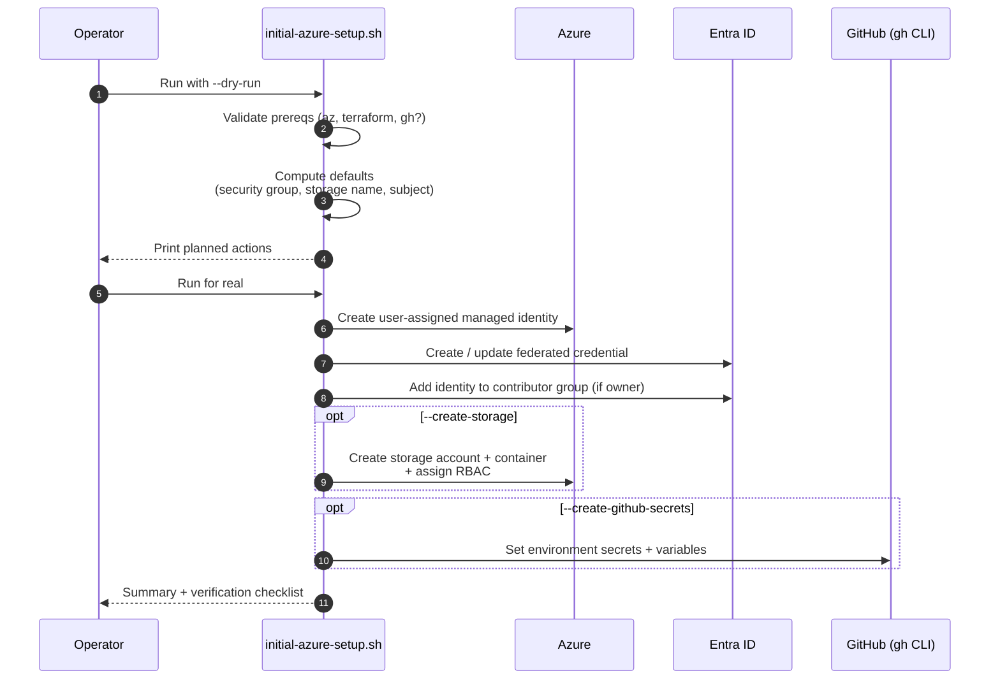
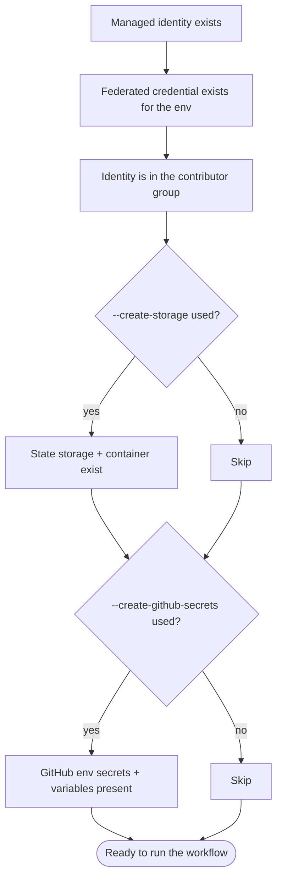

# Initial Azure Setup

> One-time **GitHub Actions ↔ Azure OIDC bootstrap** for this repository. After this step, the
> deployment workflow can `terraform apply` without ever storing a client secret.

← Back to [README.md](README.md) for the overall Bastion / jumpbox deployment flow.

---

## What you'll have at the end

```text
✓ User-assigned managed identity (in the Landing Zone networking RG)
✓ GitHub OIDC federated credential bound to <owner>/<repo>:environment:<env>
✓ Managed identity is a member of the Landing Zone contributor security group
✓ (Optional) Terraform state storage account + container
✓ (Optional) GitHub environment secrets + variables, ready for the workflow
```

The GitHub Actions workflow `deploy-terraform.yml` then runs `terraform apply` using a
short-lived OIDC token — no secrets stored in GitHub, no service principal passwords.

---

## How the OIDC trust works



**Why federation, not a secret?**

- No long-lived client secret to rotate or leak.
- Trust is **scoped to the specific repo + environment** (`subject` claim is exact-match).
- Tokens are minted per workflow run and expire automatically.

---

## What the script does



### Capabilities

`initial-azure-setup.sh` can:

- Create a user-assigned managed identity for the repo
- Create or update the GitHub OIDC federated credential for an environment
- Add the managed identity to the Landing Zone contributor security group
- Create a storage account and container for Terraform state
- Assign storage and Key Vault RBAC needed by the deployment flow
- Optionally create GitHub environment secrets and variables via `gh`

---

## Prerequisites

| Requirement | Required? | Notes |
|---|:---:|---|
| Azure CLI (`az`) | ✅ | Run `az login --tenant 6fdb5200-3d0d-4a8a-b036-d3685e359adc` first; complete browser MFA |
| Terraform | ✅ | Script checks for it before proceeding |
| GitHub CLI (`gh`) | Optional | Only when using `--create-github-secrets` |
| Subscription + RG access | ✅ | On the target subscription and Landing Zone networking RG |
| Entra group ownership | Optional | To auto-add the identity to `DO_PuC_Azure_Live_<license-plate>_Contributor` (or the group passed with `--security-group`). If you are not an owner, the script still creates the identity and OIDC federation; a project lead adds membership manually afterward. |
| GitHub repo admin | Optional | Only when using `--create-github-secrets` |

---

## Inputs

### Required

| Option | Meaning |
|---|---|
| `-g`, `--resource-group` | Landing Zone networking resource group |
| `-n`, `--identity-name` | User-assigned managed identity name |
| `-r`, `--github-repo` | GitHub repo in `owner/repository` format |
| `-e`, `--environment` | GitHub environment name (`dev`, `test`, `prod`, `tools`) |

### Optional

| Option | Meaning | Default |
|---|---|---|
| `-s`, `--subscription-id` | Subscription to target | Current `az` context |
| `-sg`, `--security-group` | Explicit Entra contributor group | `DO_PuC_Azure_Live_<license-plate>_Contributor` |
| `--contributor-scope` | Reserved scope input exposed by the script | — |
| `--storage-account` | Override generated state storage account name | `tf<environment><repo>` (lowercased, alphanumeric, truncated) |
| `--storage-container` | Storage container name | `tfstate` |
| `--create-storage` | Create the Terraform state storage | off |
| `--create-github-secrets` | Create GitHub env secrets + variables via `gh` | off |
| `--dry-run` | Print actions without changing Azure or GitHub | off |
| `-h`, `--help` | Show script help | — |

---

## Quick start

> Run all commands from the repository root.

### Step 1 — Dry-run first (recommended)

Always preview before mutating Azure or GitHub.

```bash
bash ./initial-azure-setup.sh \
  -g "<landing-zone-networking-rg>" \
  -n "<managed-identity-name>" \
  -r "<repo-owner>/<repo-name>" \
  -e "<environment>" \
  -s "<subscription-id>" \
  --create-storage \
  --dry-run
```

Inspect the printed plan. If it looks right, drop `--dry-run`.

### Step 2 — Create identity, federation, and state storage

```bash
bash ./initial-azure-setup.sh \
  -g "<landing-zone-networking-rg>" \
  -n "<managed-identity-name>" \
  -r "<repo-owner>/<repo-name>" \
  -e "<environment>" \
  -s "<subscription-id>" \
  --create-storage
```

### Step 3 — Also write GitHub environment secrets (optional)

```bash
bash ./initial-azure-setup.sh \
  -g "<landing-zone-networking-rg>" \
  -n "<managed-identity-name>" \
  -r "<repo-owner>/<repo-name>" \
  -e "<environment>" \
  -s "<subscription-id>" \
  --security-group "DO_PuC_Azure_Live_<license-plate>_Contributor" \
  --create-storage \
  --create-github-secrets
```

<details>
<summary><strong>Concrete example for this repository</strong></summary>

```bash
bash ./initial-azure-setup.sh \
  -g "<landing-zone-networking-rg>" \
  -n "eo-dmi-alz-bastion-jumpbox-<environment>-identity" \
  -r "bcgov/eo-dmi-alz-bastion-jumpbox" \
  -e "<environment>" \
  -s "<subscription-id>" \
  --create-storage
```
</details>

---

## Naming behavior

The script derives several values automatically:

| Derived value | How it's computed |
|---|---|
| Security group | `DO_PuC_Azure_Live_<license-plate>_Contributor` where `<license-plate>` is the prefix before the first `-` in the resource group name |
| Storage account | `tf<environment><repo>`, lowercased, stripped to alphanumerics, truncated to Azure storage naming limits |
| Federated subject | `repo:<owner>/<repo>:environment:<environment>` |
| `SUBSCRIPTION_NAME` variable | Derived from the Azure subscription display name |

---

## What gets written

### Azure

- User-assigned managed identity in the target resource group
- Federated credential on that identity (subject above)
- (If `--create-storage`) storage account + `tfstate` container + RBAC for the identity
- (If you have permission) membership in the Landing Zone contributor security group

### GitHub (only with `--create-github-secrets`)

| Scope | Name | Purpose |
|---|---|---|
| Environment secret | `AZURE_CLIENT_ID` | Managed identity client ID — used by `azure/login@v2` |
| Environment secret | `AZURE_SUBSCRIPTION_ID` | Target subscription |
| Environment secret | `AZURE_TENANT_ID` | Entra tenant |
| Environment secret | `VNET_NAME` | Landing Zone VNet to attach to |
| Environment secret | `VNET_RESOURCE_GROUP_NAME` | RG of the Landing Zone VNet |
| Environment secret | `VM_ADMIN_LOGIN_PRINCIPAL_IDS` | Optional JSON array of Entra object IDs to grant `Virtual Machine Administrator Login` on the jumpbox VM |
| Environment variable | `STORAGE_ACCOUNT_NAME` | Terraform state storage |
| Repo variable | `SUBSCRIPTION_NAME` | Human-readable subscription name |
| Repo secret | `SOURCE_VNET_ADDRESS_SPACE` | Written **only** when `environment = tools` |

---

## Verify the bootstrap

After the script finishes, confirm the following before running the deployment workflow.



### Spot checks

```bash
# Managed identity
az identity show \
  --resource-group "<landing-zone-networking-rg>" \
  --name           "<managed-identity-name>" \
  --query "{name:name, clientId:clientId, principalId:principalId}" -o table

# Federated credential
az identity federated-credential list \
  --identity-name  "<managed-identity-name>" \
  --resource-group "<landing-zone-networking-rg>" -o table

# Group membership (requires Entra read permission)
az ad group member check \
  --group "<security-group>" \
  --member-id "$(az identity show \
                   --resource-group <landing-zone-networking-rg> \
                   --name           <managed-identity-name> \
                   --query principalId -o tsv)"

# GitHub env secrets (requires gh + repo admin)
gh secret   list --env <environment> --repo <owner>/<repo>
gh variable list --env <environment> --repo <owner>/<repo>
```

---

## Troubleshooting

| Symptom | Likely cause | Fix |
|---|---|---|
| `az ad group member add` fails | Operator is not an owner of the contributor group | Re-run without group changes; ask a group owner to add the identity afterward |
| Federated credential already exists | Subject reused for the same environment | Safe — the script updates in place; re-run is idempotent |
| Storage account name unavailable | Generated name collides globally | Override with `--storage-account <unique-name>` |
| `gh` operations fail | Not authenticated or not a repo admin | `gh auth login`; ensure your account has admin on the target repo |
| Workflow run still fails with auth | OIDC subject mismatch | Check the federated credential `subject` matches `repo:<owner>/<repo>:environment:<environment>` exactly |
| Terraform backend init fails | RBAC on state storage hasn't propagated | Wait a few minutes; verify the identity has `Storage Blob Data Contributor` on the account |

---

## Next steps

1. Confirm the verification checks above pass.
2. Trigger the `deploy-terraform.yml` workflow for the target environment.
3. Return to **[README.md](README.md)** for the developer connection flow once the
   Bastion and jumpbox are deployed.
